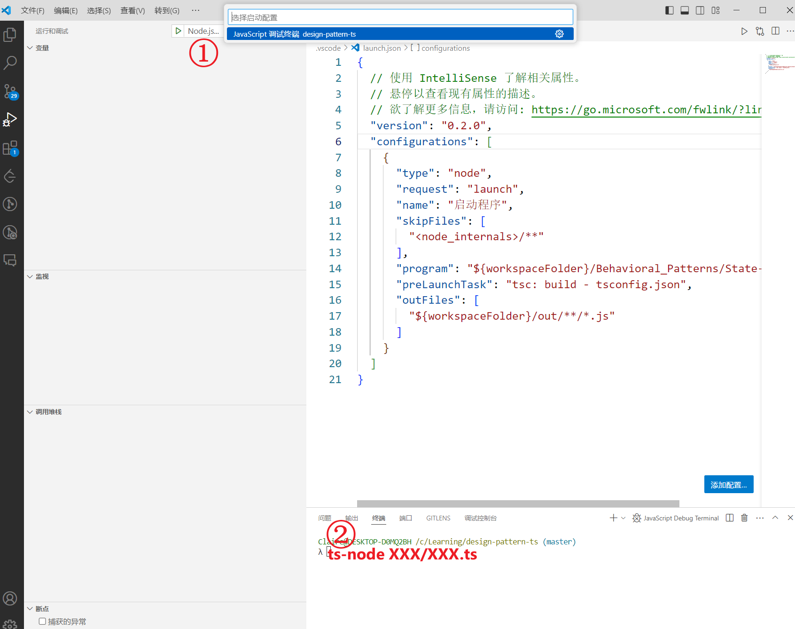

# design-pattern-ts
Design pattern source code for teacher Liu Wei's course. 刘伟老师设计模式源码，Typescript 实现

书籍：[当当](https://product.dangdang.com/25582002.html)，[京东](https://item.jd.com/12457801.html)

参考资料：[史上最全设计模式导学目录（完整版）](https://blog.csdn.net/LoveLion/article/details/17517213)，[设计模式](https://refactoringguru.cn/design-patterns)

视频：[https://space.bilibili.com/532642825/channel/series](https://space.bilibili.com/532642825/channel/seriesdetail?sid=3658936)

# 调试

1. 安装 ts-node:

```shell
npm install -g ts-node
```

2. 调试选择 Nodejs
3. 命令行输入：

```shell
ts-node 文件路径/文件名.ts
```


